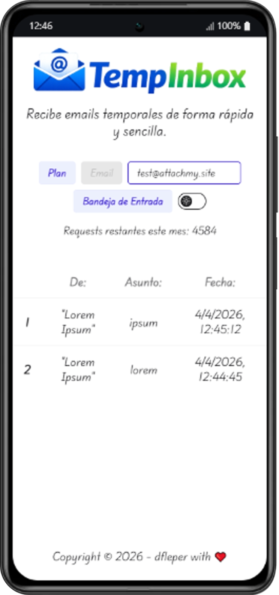
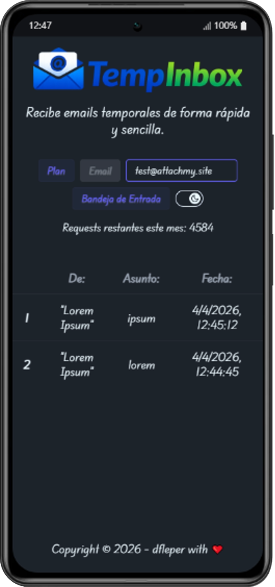
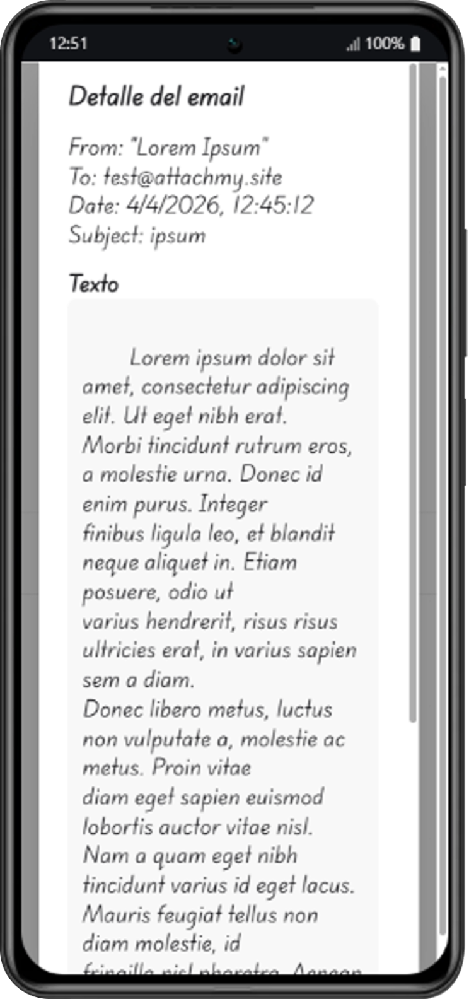
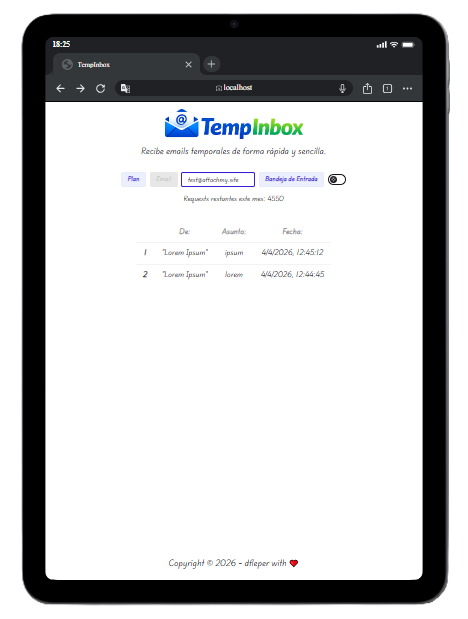
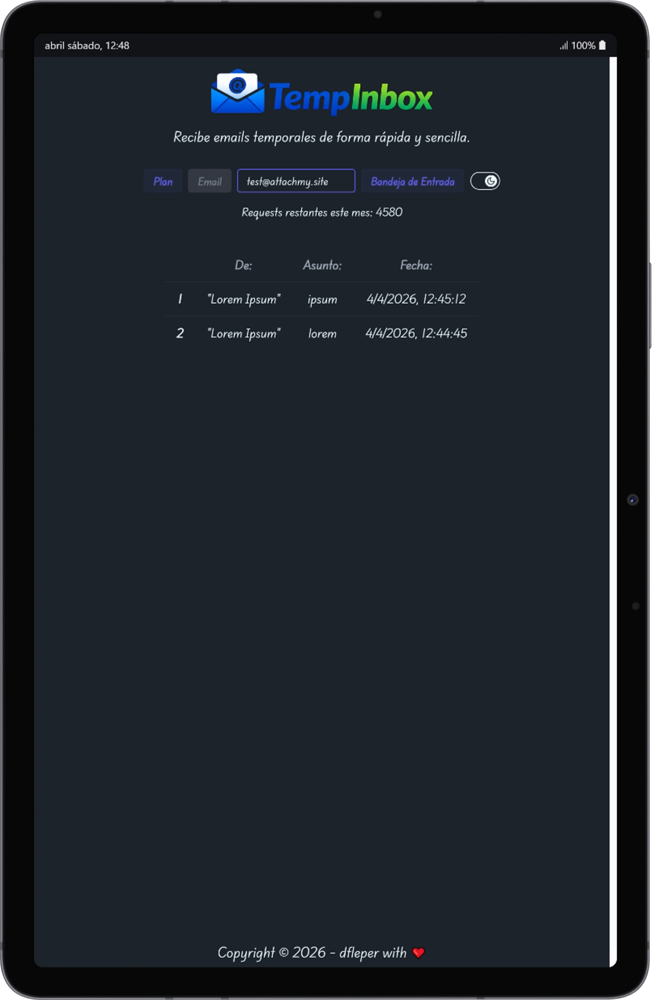
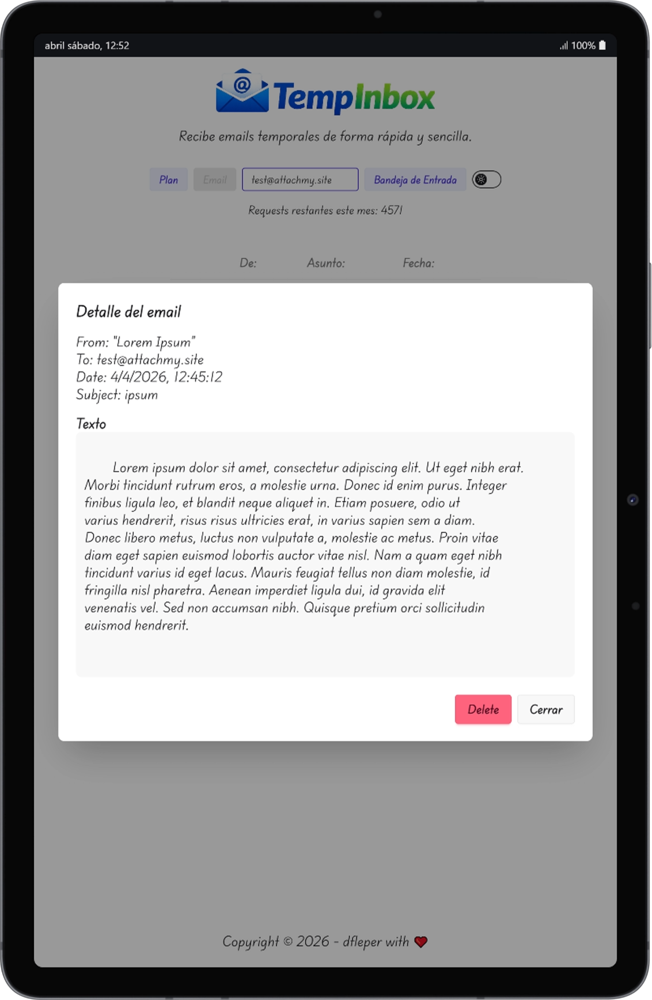
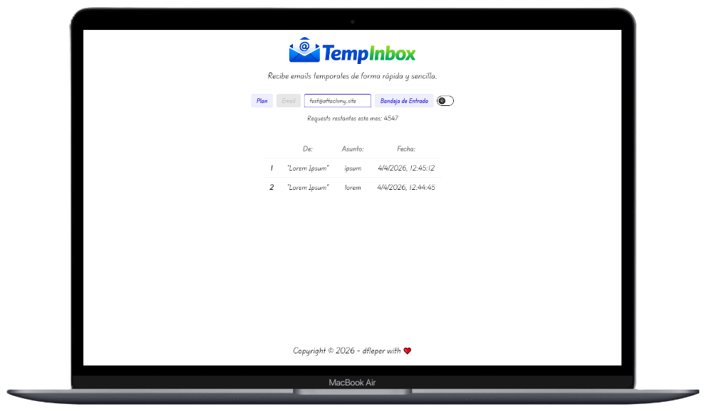
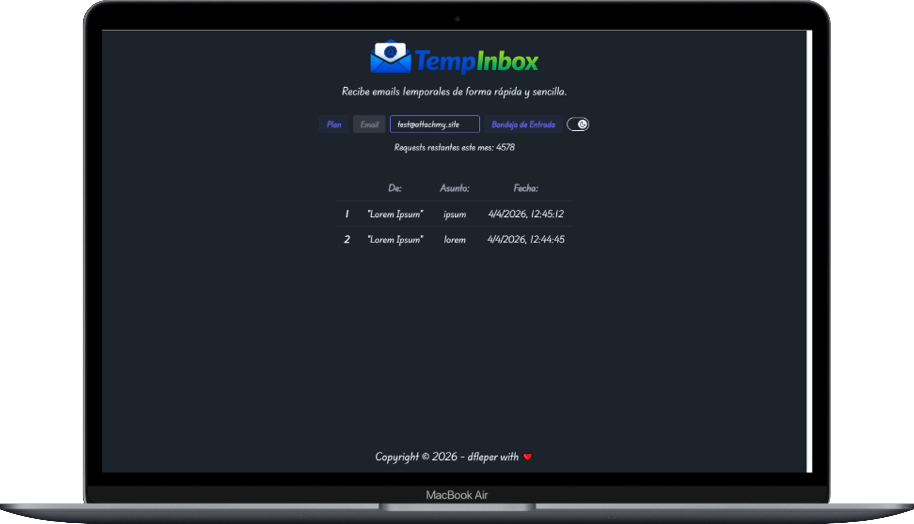
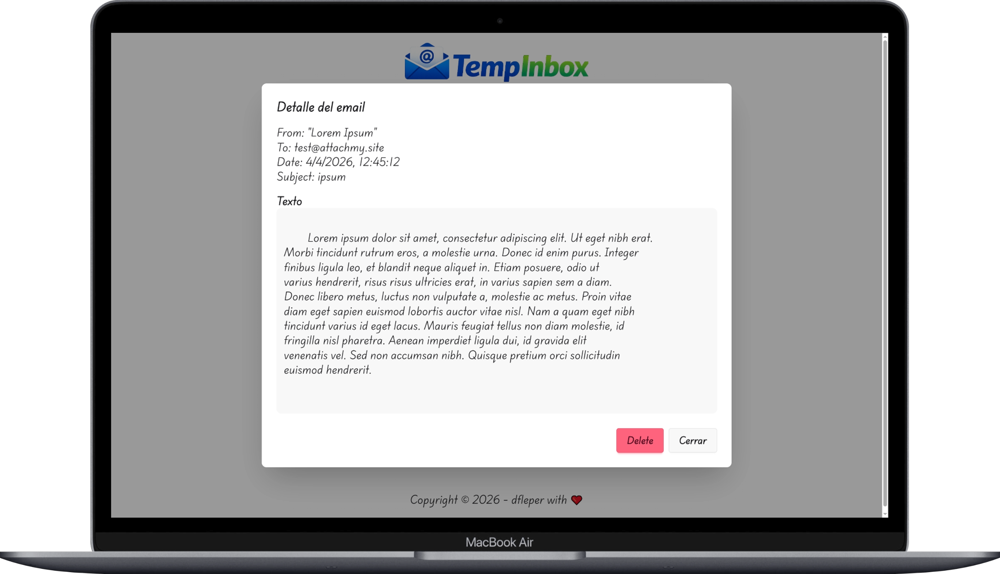

 
 
 
<div style="display: flex; align-items: center; gap: 12px;">
   
</div>
 
<p align="center">
   <a href="README.es.md">
      
   </a>
   &nbsp;
   <a href="README.md">
      
   </a>
 </p>
 
 # TempInbox
 
 TempInbox is a simple temporary email inbox built with HTML5, CSS3 and JavaScript, powered by the FreeCustom Email API for quick disposable email reception.
 
 ---

 ### Setting up locally

To run the project locally, follow these steps:

**1.** Install the project dependencies:

```bash
npm install
```
**2.** Start the backend server:

```bash
npm run dev:backend
```
**3.** Start the frontend application:

```bash
npm run dev:frontend
```
---

### Technology stack

- **Frontend:** HTML5, CSS3, Vanilla JavaScript, Tailwind CSS
- **Bundler / development environment:** Vite (Version **8.0.1**)
- **Backend:** Node.js (Version **v24.14.1**)
- **API freecustom-email:** (Version **1.0.0**)

---

## Screenshots

### Mobile View

<div style="display: flex; gap: 12px; justify-content: center; margin-bottom: 12px;">
  
  
  
</div>

---

### Tablet View

<div style="display: flex; gap: 12px; justify-content: center; margin-bottom: 12px;">
  
  
  
</div>

---

### Desktop View

<div style="display: flex; gap: 16px; justify-content: center; margin-bottom: 12px;">
  
  
</div>

<div style="display: flex; gap: 16px; justify-content: center; margin-bottom: 24px;">
  
</div>

---

## Legal
- See 📄 **[NOTICE.md](NOTICE.md).** All rights reserved.